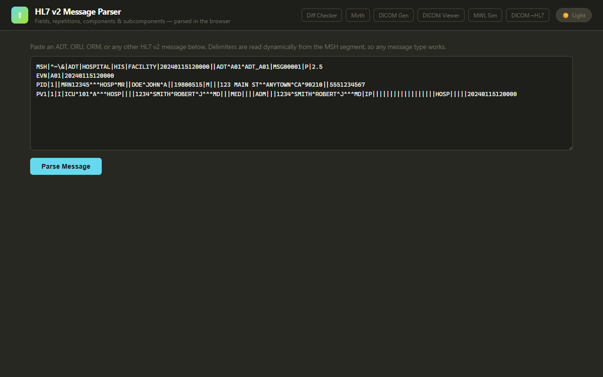
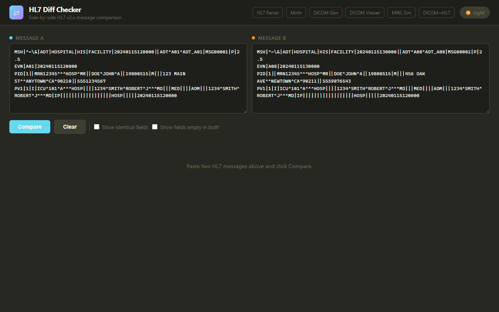
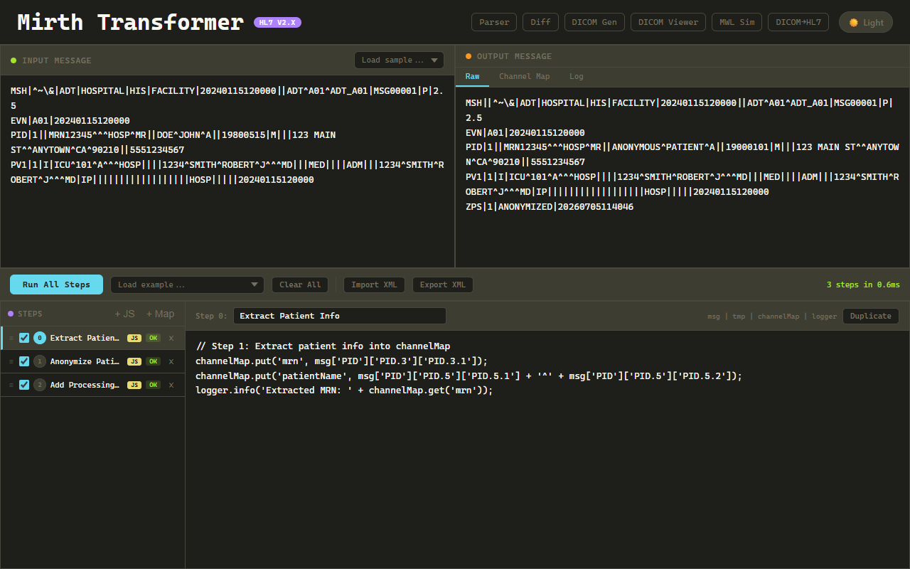
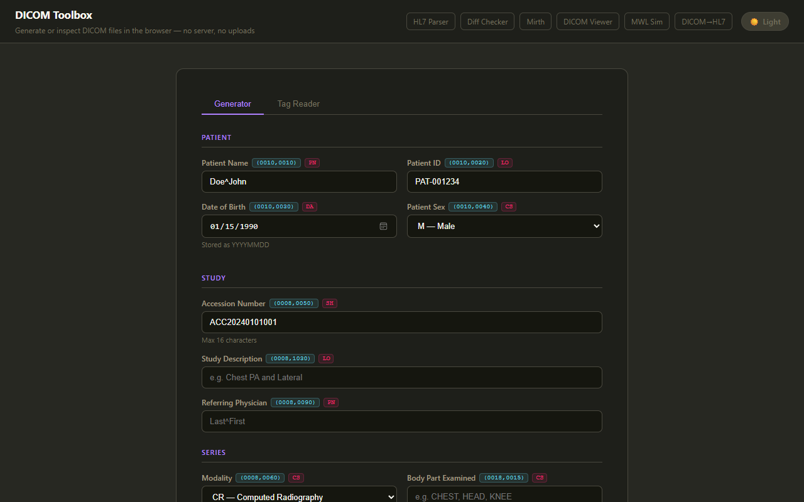
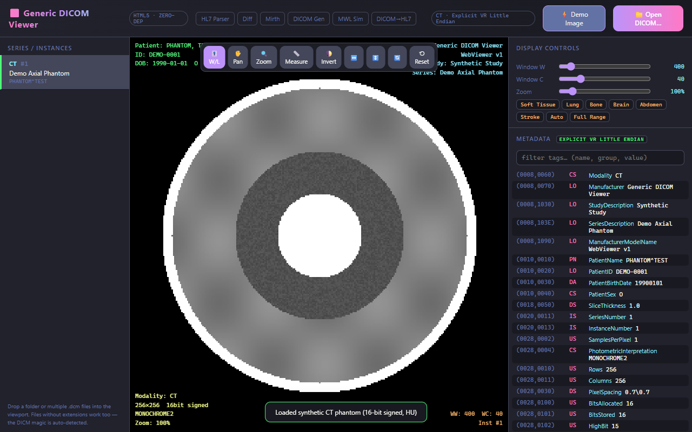
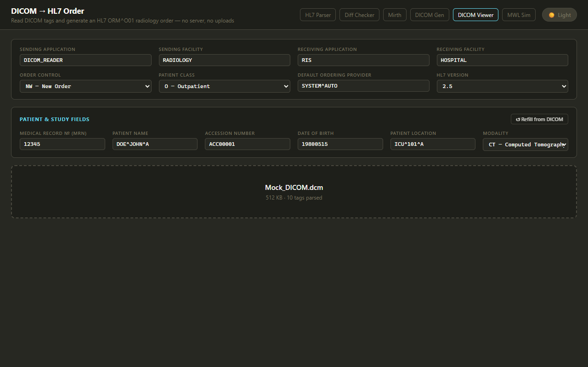
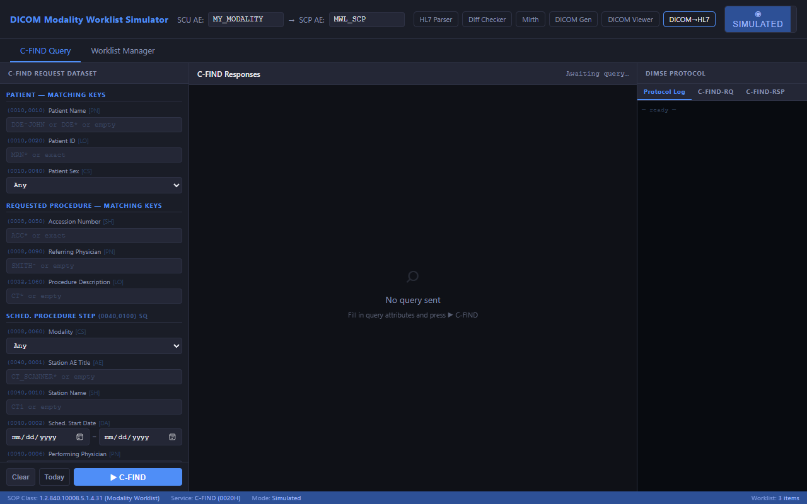

# HL7 / DICOM Tools Workspace

Browser-based tools for working with HL7 v2.x and DICOM medical data standards.
Every HTML tool is single-file and zero-dependency — open it in a browser and go;
no build step, no server, and no data leaves your browser.

A curated set of these tools is published at **[ocha.dev](https://ocha.dev)**
("Healthcare Data Tools"), served from [`pages-repo/`](pages-repo/).

## Tools

| File | Title | What it does | Preview |
|------|-------|--------------|---------|
| [`msgparser.html`](msgparser.html) | HL7 v2 Parser | Parse HL7 v2.x messages into a segment/field breakdown | 

View

 |
| [`hl7-diff.html`](hl7-diff.html) | HL7 Diff Checker | Compare two HL7 messages side by side | 

View

 |
| [`mirth-transformer.html`](mirth-transformer.html) | Mirth Transformer Tester | Test Mirth Connect transformer JavaScript against sample messages | 

View

 |
| [`dicom-generator.html`](dicom-generator.html) | DICOM Toolbox | Generate valid Explicit VR Little Endian DICOM files (Secondary Capture), with custom image upload | 

View

 |
| [`dicom-viewer.html`](dicom-viewer.html) | Generic DICOM Viewer | View DICOM files and their tag data | 

View

 |
| [`dicom-hl7-order.html`](dicom-hl7-order.html) | DICOM → HL7 Order Generator | Build HL7 order messages from DICOM attributes | 

View

 |
| [`mwl-simulator.html`](mwl-simulator.html) | DICOM MWL Simulator | Simulate a DICOM Modality Worklist | 

View

 |

## Subprojects

- [`mwl-emulator/`](mwl-emulator/) — Python command-line DICOM MWL C-FIND SCU
  (acts like a modality querying a worklist server), built on pynetdicom.
  See its own [README](mwl-emulator/README.md).
- [`pages-repo/`](pages-repo/) — Jekyll source for the ocha.dev GitHub Pages site;
  published copies of the tools live in `pages-repo/tools/`.

## Shared theme

[`theme.css`](theme.css) + [`theme.js`](theme.js) provide the shared Monokai
dark/light theme used by `msgparser.html`, `dicom-generator.html`, and
`hl7-diff.html`. The theme choice persists across tools via the
localStorage key `hl7-tools-theme`.

## Development

Dev server configs live in `.claude/launch.json` (`npx serve` on port 3000,
`python3 -m http.server` on 8080, plus configs for related projects below).
The tools also work opened directly as `file://`.

## Related projects (outside this folder)

- **HL7 parser with mapping file** — `/Users/meiosis/hl7-parser/`
  ([github.com/coffeemilktea/hl7-parser](https://github.com/coffeemilktea/hl7-parser)):
  ADT/ORM/ORU parser driven by an editable `mappings.json` for custom field
  labels, value translations, and message rewrites.

> Note: this folder lives in OneDrive for sync; standalone projects with git
> repos are kept outside it (OneDrive and git histories don't mix well).
